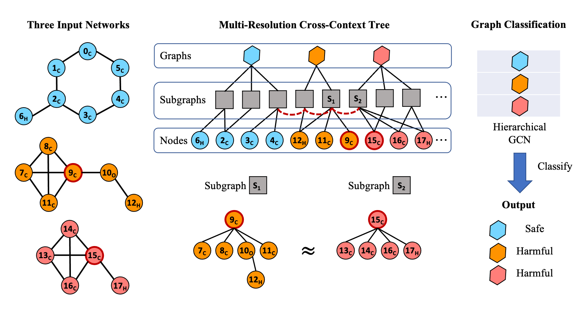

# H₂C₂GCN: Heterogeneous and Hierarchical Cross-context Graph Convolution Network

## Abstract
Given attributed graphs, how can we accurately classify them using both topological structures and node features? Graph classification is a crucial task in data mining, especially in the bioinformatics domain where a chemical compound is represented as a graph of attributed compounds. Although there are existing methods like graph kernels or truncated random walks for graph classification, they do not give good accuracy since they consider features present at a single resolution, i.e., nodes or subgraphs. Such single resolution features result in a biased view of the graph's context, which is nearsighted or too wide, failing to capture comprehensive properties of each graph.
In this paper, we propose H₂C₂GCN (Heterogeneous and Hierarchical Cross-context Graph Convolution Network), an accurate end-to-end framework for graph classification. Given multiple input graphs, H₂C₂GCN generates a multi-resolution tree that connects the given graphs by cross-context edges. It gives a unified view of multiple graphs considering both node features and topological structures. We propose a novel hierarchical graph convolutional network to extract the representation of each graph. Extensive experiments on real-world datasets show that H₂C₂GCN provides the state-of-the-art accuracy for graph classification.

## Overview
1. **Multi-resolution mapping.** In a graph there are multiple objects having different resolutions: nodes, subgraphs, and the graph itself. We generate a new tree having the objects of each graph as its nodes, as shown below, to make them exchange multi-resolution information.
2. **Cross-context edges.** We connect the subgraphs of multiple graphs if their similarity is larger than a threshold, as the red dotted lines in the figure below, combining the trees as a single multi-resolution cross-context tree (MRCCT) that contains information of all graphs simultaneously.
3. **Hierarchical GCN.** We propose Hierarchical GCN, a graph neural network specialized for hierarchically structured graphs having initial features only for a subset of nodes. We apply the Hierarchical GCN to extract graph embeddings suitable for graph classification.

## Code Description
* `src/layers.py`: Graph Convolutional Network (GCN)
* `src/main.py`: Main function
* `src/models.py`: Model architecture of Hierarchical GCN
* `src/mrcct.py`: Constructs multi-resolution cross-context tree
* `src/utils.py`: Utility functions

## Getting Started
The source codes are based on `Python 3.7`. Our implementation has been tested on UNIX-based environments.
The required Python packages are described in `./requirments.txt`.
If `pip3` is installed on your system, you can type the following command to
install the required packages.
Additionally, PyTorch geometric is required to download the datasets, install the version that suits your system.
```bash
pip3 install -r requirments.txt
```

## Dataset Format
The input of `H₂C₂GCN` are four `txt` files: `A.txt`, `graph_indicator.txt`,`graph_labels.txt`, and `node_labels.txt`.

### `A.txt` Format
Adjacency matrix for all graphs.
```csv
2, 1
1, 2
3, 2
2, 3
...
```

### `graph_indicator.txt` Format
Line number represents node id and the value written in the `txt` file represents which graph the node belongs to.
```csv
1
1
2
2
...
```

### `graph_labels.txt` Format
Line number represents graph id and the value written in the `txt` file represents graph's label (binary).
```csv
1
1
-1
-1
...
```

### `node_labels.txt` Format
Line number represents node id and the value written in the `txt` file represents node's label.
```csv
0
0
1
2
...
```

## Datasets
We use five benchmark datasets in the table below for graph classification.
Datasets are automatically downloaded when the code is executed.
Additionally, all of our datasets are publicly available in this [link](https://ls11-www.cs.tu-dortmund.de/staff/morris/graphkerneldatasets).

| Dataset  | # of Graphs | # of Classes | # of Attributes | Average # of Nodes |
|----------|------------:|-------------:|----------------:|-------------------:|
| MUTAG    |         118 |            2 |               7 |               17.9 |
| PTC      |         344 |            2 |              19 |               25.5 |
| PROTEINS |       1,113 |            2 |               3 |               39.1 |
| NCI1     |       4,110 |            2 |              37 |               29.8 |
| NCI109   |       4,147 |            2 |              38 |               29.6 |

## Demo
We provide demo script with sample data in python environment.  
Before running demo, you install the python packages in `requirements.txt` file.
In the `bash` command line, 
```bash
bash demo.sh
```
The demo script runs `main.py`.
